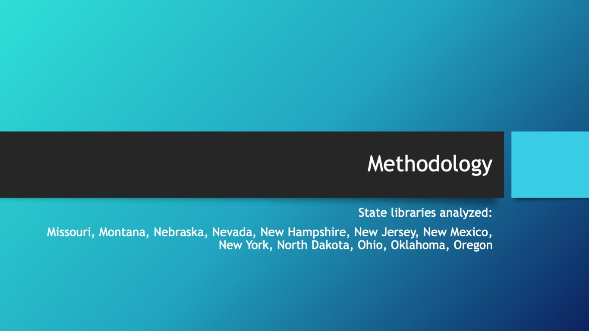

*I worked with a team to analyze the content of several library Twitter accounts using R packages. These are the slides and the transcript of our presentation. This was originally created for my Information Networks class in the Fall of 2018.*

<figure class="wp-block-image alignwide">
    
</figure>

<figure class="wp-block-media-text__media">
    
</figure>

With the rise of social media, researchers are not limited to older data gathering methods, such as surveys or case studies, because people around the world are able to share their thoughts digitally. Researchers can examine this data and use statistical models to find trends. However, research using social media data is meant to complement or improve upon the statistics generated by socioeconomic indicators, and social media data may be skewed because there is less Twitter use in lower income areas (Mao, 2015, p.92-93). In this discussion, we will focus upon Twitter data gathered from state libraries across the U.S.

---

<figure class="wp-block-media-text__media">

</figure>

By studying this trove of text data, we can find new patterns in health issues, election analysis, and information needs. We can also see how social media users interact with each other and with institutions, and how information disseminates across the network. Choi and Jooin 2018 studied the effectiveness and perception of multiple social media platforms in public library marketing, and respondents to surveys distributed to over 4,000 US libraries perceived social media as an important tool. We can also study the feelings and opinions of Twitter users with sentiment analysis, so institutions can better understand how they’re perceived on social media.

---

<figure class="wp-block-media-text__media">

</figure>

Twitter data analysis is applicable to a broad array of topics beyond libraries. According to Gayo-Avello(in 2015), counting the frequency of tweets discussing a candidate or political party can provide insight into upcoming election results. Public health crises follow predictable patterns on Twitter, as well. Tweets about the flu correspond closely to CDC-reported rates of the flu, and Tweets about illnesses are more common in states with lower exercise rates (Paul &amp; Dredge, 2011, pp. 268-269). Even natural disasters are ripe for analysis. During a predicted disaster, such as supertyphoonHaiyan, Twitter users spread news and stories related to the storm across their network (David, Legara, &amp; Ong, 2016, p. 14).

---

<figure class="wp-block-media-text__media">

</figure>

Libraries are able to utilize social media for various purposes, from disseminating marketing materials to answering reference questions.

Shiri &amp; Rathi(2013) used data mined from Twitter to identify several categories of how users interact with a public library on social media. Recommendations, advisory services, and information seeking were prominent topics. The study suggests libraries should use Twitter to mine information from their patrons for library activities, collection services and user assistance.

Stewart &amp; Walker (2018) used Twitter data mining to identify which types of tweets from libraries create the most engagement from patrons, such as replies or “retweets.” The accounts which received the most user interaction, and higher sentiment score, were ones that directly engaged users and that posted content related to the larger institution.

In both of these studies, the researchers are able to make data-driven recommendations to their respective libraries on how to best engage with patrons on social media.Libraries can also use Twitter to disseminate information that is directly relevant to its patrons, such as local events or services.

<figure class="wp-block-image alignwide">

</figure>

<figure class="wp-block-media-text__media">

</figure>

This slide illustrates the use of Word Frequency Analysis using R. The state library raw Twitter data was downloaded and converted into dataframe. Words were then extracted using the unnesttoken function, stop words removed and then filtered by those words with frequency greater than 100. The chart was created using the ggplotgraphing package. The coordinates were “flipped” for legibility of the words.

---

<figure class="wp-block-media-text__media">

</figure>

Sentiment analysis the Twitter data was used to create charts to display the positive and negative tweets for each library. Using the bingpackage for sentiment analysis we “matched” the top ten positive and negative words in each state’s dataset. Each state’s results were then separated into positive and negative groups and plotted on bar charts for comparison. For the Nevada tweets, there were many more tweets represented because of the “tie” in the number of top ten tweets, Therefore, there were 18 different words represented in the chart.

Sentiment analysis was also used to create pie charts to compare positive, negative and neutral tweets. Wordcloudcharts depict a graphic representation of the frequency of positive and negative words with size of font corresponding to frequency of the wordcount.

---

<figure class="wp-block-media-text__media">

</figure>

These charts show the top ten words by topic for the Missouri State Library Tweets. Topic Modeling and the Latent Dirichlet Allocation (LDA) was used to classify words in a dataset or wordgroupinto topics.

First convert the dataset to a corpus, remove emojiiesand use only English words, convert the corpus into DocumentMatrix. To further clean the data use “stemming” and remove the stopwords, numbers, punctuation, “http” and non-ASCII “words” and words shorter than 3 letters. Convert the Document Term Matrix (dtm) into a matrix R will understand with the as.matrixfunction.

Extract topics -10 - using LDA Latent Dirichlet Allocation – this function groups the related words into topics. Extract the words in each of the topics using the “tidy” function with the “beta” variable. Use “ap_topics” and “”top_n(10)” to extract top 10 topics. Plot the output on a bar chart using the ggplot/geom_colfunctions.

<figure class="wp-block-image alignwide">

</figure>

<figure class="wp-block-media-text__media">

</figure>

We generated pie charts to convey the overall sentiment of each library’s tweets. Most of the libraries were basically the same: a majority of positive words, a few negative words, and maybe a few neutral words. There were a few outliers, however. Montana, notably, was overwhelmingly positive and had no neutral words. New York and Oregon, conversely, had the highest amount of negative words. The New York account was focused on poetry, however, so it used a variety of words that weren’t common among the other library twitter accounts.

---

<figure class="wp-block-media-text__media">

</figure>

To find the most common and most uncommon words, we referenced our charts that showed the frequency of words appearing more than 100 times. We picked out some common patterns.

First, every library used several “non-words,” urlparts or RT, extensively. But when we look at the actual words, we can see the results in our second column here. Each of these words appeared in more than one library’s chart. For example, ”library” appeared in 7 charts and ”check” appeared in 5. And finally, we have our uncommon words. These only appeared in one library’s chart. Note that, for this presentation, we didn’t include place names or names of services specific to one library. There were too many to list, but they also only were mentioned by one library.

---

<figure class="wp-block-media-text__media">

</figure>

When we did a topic analysis, our libraries’ topics were all over the place, which made finding five common topics challenging. Here you can see our picks of the most common, along with an example chart to represent each one.

The most common topic was event announcements, which appeared at least once in six different libraries. In this chart, you can see Oklahoma announcing a concert series at noon today.

Six libraries also featured topics about books and reading. Here we can see one of those topics from the New Jersey library.

Four libraries had topics about contests and prizes. These were either advertising a contest so people could enter, or announcing a winner. Here, we can see North Dakota advertising a chance to win a prize.

Three libraries had topics about job openings. Here we can see a sample from New Mexico about a job for a librarian or director position.

Finally, we found two libraries discussing summer reading. You can see New Mexico promoting it in this topic.

---

<figure class="wp-block-media-text__media">

</figure>

There were some topics that only seemed to show up in one library.

Missouri discussed voting extensively. Unlike the other library Twitter accounts, our Missouri data came from the Missouri Secretary of State account, which most likely explains why it’s so different.

Next, Nebraska discussed professional development a lot. The Nebraska Library Commission hosts a lot of webinars and classes, so it makes sense that they would promote them on Twitter.

And finally, we noticed that Nevada was the only one that mentioned National Library Week along with doughnuts. Maybe it was also discussing National Doughnut Day?

---

<figure class="wp-block-media-text__media">

</figure>

And here are the interesting topics and patterns.

The first thing we noticed were the anomalies. Missouri’s secretary of state account and New York’s Poets House account both showed drastically different results than the accounts from state libraries and public libraries. This made comparing them to the others quite difficult.

The biggest similarities between all of the accounts was their use of social media for marketing. A lot of the topics were used for advertising events and services.

And finally, because these states are literally “all over the map” it was difficult for us to interpret these results based on locale. In the future dividing the states into quadrants might lead to interesting comparisons between groups.

<figure class="wp-block-image alignwide">

</figure>

## References

1. Choi, N., &amp; Joo, S. (2018). Understanding public libraries’ challenges, motivators, and perceptions toward the use of social media for marketing. *Library Hi Tech*. https://doi.org/10.1108/LHT-11-2017-0237
2. Dahl, A.A., Karami, A., Kharrazi, Shaw, G. Jr., Turner-McGrievy, G. (2017). Characterizing diabetes, diet, exercise, and obesity comments on Twitter. *International Journal of Information Management, 38*, 1-6. http://dx.doi.org/10.1016/j.ijinfomgt.2017.08.002
3. David, C.C., Legara, E.F.T., &amp; Ong, J.C. (2016). Tweeting supertyphoonHaiyan: Evolving functions of Twitter during and after a disaster event. *PLoSONE, 11*(3), 1-19. doi:10.1371/journal.pone.0150190
4. Gayo-Avello, D. (2015). Political opinion. In M. W. Macy, Y. Mejova, &amp; I. Weber (Eds.), *Twitter: a digital socioscope*. New York, NY: Cambridge University Press.
5. Mao, H. (2015). Socioeconomic indicators. In M. W. Macy, Y. Mejova, &amp; I. Weber (Eds), *Twitter: a digital socioscope*(pp. 75-95). New York, NY: Cambridge University Press.
6. Paul, M. J., &amp; Dredze, M. (2011). You are what you Tweet: Analyzing Twitter for public health. *Icwsm*, *20*, 265-272. https://www.aaai.org/ocs/index.php/ICWSM/ICWSM11/paper/viewFile/2880/3264
7. Shiri, A., &amp; Rathi, D. (2013). Twitter content categorisation: a public library perspective. *Journal of Information &amp; Knowledge Management*,*12*(4). https://doi.org/10.1142/S0219649213500354
8. Stewart, B., &amp; Walker, J. (2018). Build it and they will come? Patron engagement via twitter at historically black college and university libraries. *The Journal of Academic Librarianship*,*44*(1), 118–124. https://doi.org/10.1016/j.acalib.2017.09.016
9. Stvilia, B &amp; Gibradze, L. (2014). What do academic libraries tweet *about*, and what makes a library tweet useful? *Library and Information Science Research, 36*(3-4), 136-141. http://doi.org/doi:10.1016/j.lisr.2014.07.001