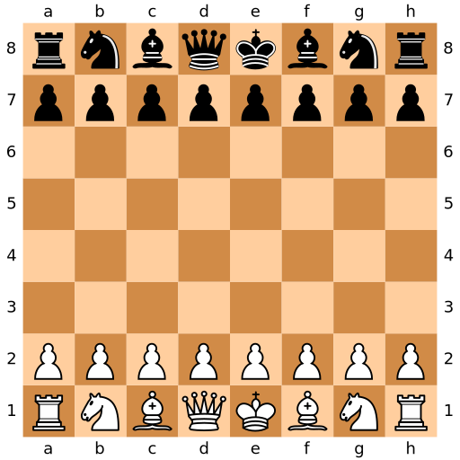

This guide covers all the knowledge required to play a basic game of chess. It’s a quick reference resource, one that can answer questions like: “how many squares do you move when castling?” or “what conditions make a stalemate?” Even if you know these rules by heart, it’s useful to have a text to cite so your opponent doesn’t think you just made up “*en passant*.”

Many chess guides exist, so why use this one? I originally wrote this in 2017 as a handout for our [public library chess program](/libraries/chess-library/). After searching for a basic rule booklet, I had only found one-page diagrams of piece moves or hundred-page long books of strategy. Necessity led me to write this, a guide that’s simple yet also covers all the common rules.

## Setting up the board

A game of chess has two players, one with “*white*” pieces and one with “*black*” pieces (although you may actually see them as green, blue, or any color). The chessboard is made of alternating dark and light squares, eight wide and eight long.


<div class="wp-block-image">
<figure class="aligncenter">



</figure>
</div>

Begin the game by setting the board as shown above. Keep these details in mind:

- The lower-right square is light (“*light on right*”).
- The opposing kings face opposite to each other, and so do the opposing queens
- The white queen goes on a light square, and the black queen goes on a dark square. (“*Queen goes on her own color*.”)

## Moving the pieces

White always moves first. Then, the players take turns moving. A player cannot end their turn without moving.

Only one piece can move each turn, with the exception of “*castling*,” a special move. (See <a href="#section-special-moves">*special moves*</a>.)

Pieces cannot pass through other pieces, with the exception of moving the knight.

A player may not move a piece to a square occupied by one of their own pieces.

### Capturing

To capture a piece, the player must move one of their pieces to the same square as their opponent’s piece. The captured piece is then removed from the game.

### ♔ The king ♚


<div class="wp-block-image">
<figure class="alignright">


</figure>
</div>

The king is the most important piece, but he is also weak. He can move one square in any direction: horizontal, vertical, or diagonal.

Make sure your king always stays safe!

### ♕ The queen ♛

<div class="wp-block-image">
<figure class="alignright">


</figure></div>

The queen is the most powerful piece. She can move any number of squares in any direction: horizontal, vertical, or diagonal.

### ♖ The rook ♜

<div class="wp-block-image">
<figure class="alignright">


</figure></div>

The rook is the second most powerful piece. It can move any number of squares vertically or horizontally, but not diagonally.

### ♗ The bishop ♝

<div class="wp-block-image">
<figure class="alignright">


</figure>
</div>

The bishop can move any number of squares diagonally.

Note that bishops can only move to the same color square that they started on. Each player has one light-square bishop and one dark-square bishop.

### ♘ The knight ♞


<div class="wp-block-image">
<figure class="alignright">


</figure>
</div>

The knight doesn’t move like the other pieces. Instead of a straight line, it moves in an “*L*” shape. It will always move two squares horizontally or vertically, turn at a right angle, and finally move one more square. It is the only piece that can “hop” over other pieces.

### ♟The pawn ♙

<div class="wp-block-image">
<figure class="alignright">


<figcaption>The dots mark where the pawns can move, and the Xs mark where they can capture. </figcaption>

</figure>
</div>

The pawn is the weakest piece. It can only move one square at a time, and it always moves straight ahead.

Pawns are the only pieces that move differently to capture. They can only capture diagonally. If a piece is in the square in front of a pawn, then that pawn is blocked and cannot move.

When a pawn is still in its starting position, it has the option to move two squares instead of one.

If a pawn manages to reach the other end of the board (a difficult achievement!), then it gets “*promoted*” and becomes either a queen, a rook, a bishop, or a knight, but players almost always choose a queen.

<h2 id="section-special-moves">Special moves</h2>

### Castling

Each player has the option to “*castle*” once during a game. This is the only time when a player can move two pieces at once, the king and the rook.

The king moves two squares to the left or right towards a rook, and the rook “hops” over to the square on the other side of the king. Castling is only permitted if neither the king nor the rook has moved yet, and if there are no pieces between them.

A player may not castle out of check, into check, or through check. (See [*check, checkmate, and stalemate*](#section-check-checkmate).)


<div class="wp-block-columns has-2-columns">

<div class="wp-block-column">
<div class="wp-block-image">

<figure class="aligncenter">


<figcaption>Before castling</figcaption>

</figure>
</div>
</div>

<div class="wp-block-column">
<div class="wp-block-image">
<figure class="aligncenter">


<figcaption>After castling</figcaption>

</figure>
</div>
</div>
</div>

### En passant

This is a French term for “in passing.” En passant may happen when one pawn moves two squares to avoid capture by an opponent’s pawn.

In this situation, the attacking pawn may still capture as if the first pawn had only moved one square.

This move is only an option on the turn immediately following the first pawn’s two-square move.


<div class="wp-block-columns has-2-columns">
<div class="wp-block-column">
<div class="wp-block-image">
<figure class="aligncenter">


<figcaption>1. The black pawn advances two spaces.</figcaption>
</figure>
</div>
</div>

<div class="wp-block-column">
<div class="wp-block-image">
<figure class="aligncenter">


<figcaption>2. The white pawn captures the black pawn as if the black pawn had only advanced one space.</figcaption>
</figure>
</div>
</div>
</div>

<h2 id="section-check-checkmate">Check, checkmate, and stalemate</h2>

<div class="wp-block-image">
<figure class="alignright">


<figcaption>The black king has been checkmated by the white queen. No matter where Black moves, they can’t escape check.</figcaption>
</figure>
</div>

The goal of chess is to “*checkmate*” your opponent, so learning how to checkmate is very important.

If a piece moves to where a king could be captured on the next move, then the king is in “*check*”.

When a player’s king is in check, then that player’s next move *must* get their king out of check. That could mean moving the king, capturing the attacking piece, or placing a piece between the king and the attacking piece.

If there is no possible way out of check, then that is “*checkmate*,” and the game is over.

A player can never move their own king into check. This includes moving a piece that was previously blocking the king from check.

## Draws: when no one wins

<div class="wp-block-image">
<figure class="alignright">


<figcaption>Black has no legal move, so this is a stalemate. (If it’s Black’s turn to move.)</figcaption>
</figure>
</div>

Several situations will end the game in a draw. Some are obvious, but others can confuse even seasoned players without a reliable reference.

**Stalemate:** When one player is not in check, but has no legal move.

**Insufficient material:** The game is a draw if both sides do not have enough pieces (*material*) to checkmate. This occurs with the following combinations:

- King against king.
- King against king and bishop.
- King against king and knight.
- King and bishop against king and bishop, with both bishops on squares of the same color.

**Fifty-move rule**: Players can agree to draw if there has been no capture or pawn move in the last fifty moves by each player.

**Threefold repetition**: Players can agree to draw if the same board position has occurred three times in a row.

## Chess lingo

**Attack**: When one piece could capture another piece on its next turn.

**Capture**: The move in which a player takes a piece.

**Control**: All of the squares where a piece could capture.

**Back Rank**: The first and eighth ranks (see also: *rank*).

**Bad Bishop**: When a bishop is blocked by its own pieces.

**Blunder**: A bad move.

**Defense**: When a piece can move and meet another piece’s attack.

**Develop**: To move pieces from their starting positions.

**File**: A column on a chessboard. They are labeled with letters A through H. For example, you would say that the kings start on the “*E file*.”

<div class="wp-block-image">

<figure class="alignright">


<figcaption>The black knight is forking the white king and white queen. White cannot save both pieces.</figcaption>
</figure>
</div>

**Fork**: When a piece attacks two pieces at once.

**Gambit**: Sacrificing a piece to gain a positional advantage.

**God**: A hypothetical player who plays perfectly, with a rating around 3600. (See also: *ratings*.)

**Index**: When a player mentally makes note of every possible square where each piece could move.

**Kingside**: The half of the board where the kings start, files E through H.

**Major Piece**: A rook or a queen.

**Material**: The pieces. The player with more pieces has a “*material advantage*.”

**Minor Piece**: A knight or a bishop.

<div class="wp-block-image">
<figure class="alignright">


<figcaption>The white rook is pinning the black knight.</figcaption>
</figure>
</div>

**Pin**: When a piece is attacked but the player cannot move it because doing so would expose a more valuable piece to attack.

**Position**: How the pieces are arranged on the board. A player with a better position has a “*positional advantage*.”

**Queenside**: The half of the board where the queens start, files A through D.

**Rank**: A row on a chessboard, labeled with numbers 1 through 8.

**Ratings**: Organizations such as USCF and FIDE use number ratings to rank players. A novice will be below 1200, and a grandmaster will be above 2500. Magnus Carlson, currently the world’s highest-rated player, is in the 2800s.

**Tempo**: Time, measured by moves. When a player makes a pointless move, they “*lose tempo.*”

**Trade**: When a player captures an opponent’s piece while letting their opponent capture one of their own pieces.

**Zugzwang**: When a player is forced to make a move when they would rather pass without moving.

## End notes

To further develop your chess strategy, you should consider the guides on [lichess.org](https://lichess.org/) or any book written by a grandmaster (which I am not). I personally credit my library’s copy of *Bobby Fischer Teaches Chess* as one of the most rewarding chess books I’ve read.

Feel free to use this text to develop your own handouts or teaching aides. I adapted everything from other resources (not the least of which was [good old Wikipedia](https://en.wikipedia.org/wiki/Glossary_of_chess)).

I generated all of the board diagrams with [python-chess](https://python-chess.readthedocs.io/en/latest/). In the original handout, the diagrams are simply tables made in Microsoft Word, which seemed hardly worth the frustration.

Here’s my Python script which generated the diagrams:

```python
#!/usr/bin/env python3
import chess
import chess.svg
kings = chess.Board('8/1k6/8/8/8/5K2/8/8 w - - 0 0')
queen = chess.Board('8/8/8/8/3Q4/8/8/8 w - - 0 0')
rook = chess.Board('8/8/8/5r2/8/8/8/8 w - - 0 0')
bishop = chess.Board('8/8/8/8/8/4B3/8/8 w - - 0 0')
knight = chess.Board('8/8/3ppp2/4n3/8/8/8/8 w - - 0 0')
pawns = chess.Board('8/8/5p2/8/8/8/2P5/8 w - - 0 0')
boards = {
    'King': {
        'board': kings,
        'squares': kings.attacks(chess.F3) | kings.attacks(chess.B7),
    },
    'Queen': {
        'board': queen,
        'squares': queen.attacks(chess.D4),
    },
    'Rook': {
        'board': rook,
        'squares': rook.attacks(chess.F5),
    },
    'Bishop': {
        'board': bishop,
        'squares': bishop.attacks(chess.E3),
    },
    'Knight': {
        'board': knight,
        'squares': knight.attacks(chess.E5),
    },
    'Pawn': {
        'board': pawns,
        'squares': pawns.attacks(chess.C2) | pawns.attacks(chess.F6),
        'arrows': [
            chess.svg.Arrow(chess.C3, chess.C3),
            chess.svg.Arrow(chess.C4, chess.C4),
            chess.svg.Arrow(chess.F5, chess.F5),
        ],
    },
    'Castling part 1': {
        'board': chess.Board('4k2r/4pppp/8/8/8/8/PPPPP3/R3K3 w - - 0 0'),
    },
    'Castling part 2': {
        'board': chess.Board('5rk1/4pppp/8/8/8/8/PPPPP3/2KR4 w - - 0 0'),
    },
    'En passant part 1': {
        'board': chess.Board('8/8/8/3Pp3/8/8/8/8 w - - 0 0'),
        'arrows': [chess.svg.Arrow(chess.E7, chess.E5)],
    },
    'En passant part 2': {
        'board': chess.Board('8/8/4P3/8/8/8/8/8 w - - 0 0'),
        'squares': [chess.E5],
        'arrows': [chess.svg.Arrow(chess.D5, chess.E6)],
    },
    'Checkmate': {
        'board': chess.Board('kQ6/8/2N5/8/8/8/8/4K3 b - - 1 0'),
        'check': chess.A8
    },
    'Stalemate': {'board': chess.Board('1Q6/8/k1K5/8/2N5/8/8/8 b - - 0 0')},
    'Fork': {
        'board': chess.Board('4k3/8/8/6K1/4n3/8/3Q4/8 b - - 0 0'),
        'check': chess.G5,
        'arrows': [
            chess.svg.Arrow(chess.E4, chess.D2),
            chess.svg.Arrow(chess.E4, chess.G5),
        ],
    },
    'Pin': {
        'board': chess.Board('3q4/5k2/8/3n4/8/8/6K1/3R4 b - - 0 0'),
        'arrows': [chess.svg.Arrow(chess.D1, chess.D8)],
    }
}
svg = '<?xml version="1.0" encoding="utf-8"?>'
svg += chess.svg.board(board=chess.Board(), coordinates=True, size=512)
with open('chess_start.svg', 'w') as file:
    file.write(svg)
for board in boards:
    svg = '<?xml version="1.0" encoding="utf-8"?>'
    svg += chess.svg.board(**boards[board], coordinates=False, size=256)
    with open('chess_' + board + '.svg', "w") as file:
        file.write(svg)
```
