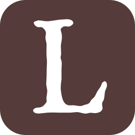

I created my own version of the LibraryThing SVG icon, and below is the code so you can reuse it for your own project. On platforms that support SVG, this should be the most versatile and portable version of their logo. You can insert it directly into HTML documents, change the colors to match your theme, resize it, or make any other edits manually.

```xml
<?xml version="1.0" encoding="UTF-8"?>
<svg xmlns="http://www.w3.org/2000/svg" version="1.1" viewBox="0 0 265 265">
    <path
        d="M 50 0 C 22.3 0 0 22.3 0 50 L 0 215 C 0 242.7 22.3 265 50 265 L 215 265 C 242.7 265 265 242.7 265 215 L 265 50 C 265 22.3 242.7 0 215 0 L 50 0 z M 130.89648 37.65625 C 134.6281 37.65625 137.72411 38.334451 140.18359 39.691406 C 142.64307 41.048362 143.87305 42.830104 143.87305 45.035156 C 143.87305 46.392112 143.19485 47.577986 141.83789 48.595703 C 140.48094 49.613411 139.54792 50.293573 139.03906 50.632812 C 137.85173 51.650529 136.06999 52.158203 133.69531 52.158203 C 130.9814 51.818964 129.03108 51.650391 127.84375 51.650391 C 125.80832 51.650391 124.23925 52.115917 123.13672 53.048828 C 122.03419 53.981731 121.14332 54.70208 120.46484 55.210938 C 119.61674 55.889416 119.19336 56.738143 119.19336 57.755859 C 119.19336 59.282434 119.53246 61.064178 120.21094 63.099609 C 120.88941 65.135036 121.22852 66.660014 121.22852 67.677734 L 121.48242 71.240234 L 121.48242 74.548828 C 121.48242 76.584255 121.14332 79.21278 120.46484 82.435547 C 119.78636 85.658314 119.44727 88.373078 119.44727 90.578125 C 119.44727 92.443938 119.53351 94.988164 119.70312 98.210938 C 119.87275 101.4337 119.95703 103.97794 119.95703 105.84375 C 119.95703 106.69185 119.78651 107.87772 119.44727 109.4043 C 119.10803 110.93087 118.93945 112.1187 118.93945 112.9668 C 118.93945 113.98451 119.27855 115.42716 119.95703 117.29297 C 120.6355 119.15878 120.97461 120.59946 120.97461 121.61719 C 121.14423 122.6349 121.22852 123.90701 121.22852 125.43359 C 121.22852 126.4513 121.14423 128.14876 120.97461 130.52344 C 120.80499 132.8981 120.7207 134.84843 120.7207 136.375 L 120.7207 154.18359 C 120.7207 155.87979 120.50803 158.08491 120.08398 160.79883 C 119.65994 163.51274 119.44727 165.29449 119.44727 166.14258 C 119.27765 169.36534 119.19336 171.65476 119.19336 173.01172 C 119.19336 174.70791 119.27765 176.06627 119.44727 177.08398 C 120.46498 186.07381 121.90762 192.68726 123.77344 196.92773 C 126.65696 203.54289 131.15151 206.85156 137.25781 206.85156 L 142.60156 206.59766 C 144.46738 206.59766 146.92538 206.85051 149.97852 207.35938 C 153.03167 207.86823 155.32304 208.12305 156.84961 208.12305 C 158.20656 208.12305 159.30816 208.03875 160.15625 207.86914 C 161.00435 207.69952 162.27647 207.27614 163.97266 206.59766 C 165.66885 205.91918 167.02525 205.49384 168.04297 205.32422 L 171.09766 204.56055 L 175.42188 202.27148 C 176.77883 199.89682 177.83828 198.15917 178.60156 197.05664 C 179.36485 195.95411 180.17144 195.06325 181.01953 194.38477 C 183.3942 192.34934 184.7506 191.07721 185.08984 190.56836 C 186.10756 189.2114 187.46593 186.75146 189.16211 183.18945 C 190.01022 181.32365 190.85698 179.71243 191.70508 178.35547 C 193.74051 175.47194 195.77707 172.50237 197.8125 169.44922 C 198.15173 168.77074 198.61727 167.49862 199.21094 165.63281 C 199.80461 163.76699 200.52496 162.49487 201.37305 161.81641 C 203.23887 160.28983 204.59722 159.52734 205.44531 159.52734 C 206.80227 159.52734 207.90385 160.28983 208.75195 161.81641 C 209.60005 163.34298 210.02539 165.12473 210.02539 167.16016 C 210.02539 169.02597 209.43147 171.27324 208.24414 173.90234 C 207.0568 176.53144 206.3345 178.48177 206.08008 179.75391 C 205.82565 181.02605 205.5287 183.57028 205.18945 187.38672 C 204.85021 191.20315 204.25824 194.21487 203.41016 196.41992 C 202.39244 198.11611 201.45943 199.81162 200.61133 201.50781 C 200.44172 203.54325 200.44172 205.40928 200.61133 207.10547 C 200.78096 208.80166 201.03382 210.41288 201.37305 211.93945 C 201.37305 213.46603 200.78108 215.07724 199.59375 216.77344 C 197.89756 219.14811 194.92799 220.75932 190.6875 221.60742 C 188.99131 221.94666 187.80348 222.11719 187.125 222.11719 C 185.76805 222.11719 184.0304 221.98881 181.91016 221.73438 C 179.78992 221.47995 178.64423 221.35352 178.47461 221.35352 C 176.77842 221.35352 175.04077 221.60833 173.25977 222.11719 C 171.47877 222.62604 170.5036 222.88086 170.33398 222.88086 C 167.62008 223.22009 164.31141 222.83689 160.41016 221.73438 C 156.50892 220.63185 153.45701 220.08203 151.25195 220.08203 C 149.55576 220.08203 147.64758 220.20846 145.52734 220.46289 C 143.4071 220.71732 141.15983 220.93 138.78516 221.09961 L 133.69531 221.09961 L 129.625 221.09961 L 126.31641 221.09961 L 123.51953 221.09961 L 114.35938 221.09961 L 105.19922 220.8457 L 102.14648 220.8457 C 98.923724 220.8457 96.082527 220.93 93.623047 221.09961 C 91.16356 221.26924 86.287764 221.77691 78.994141 222.625 L 77.212891 222.88086 C 69.071165 222.88086 65 220.67573 65 216.26562 C 65 215.58714 65.762489 214.61198 67.289062 213.33984 C 68.815636 212.06769 71.275585 211.3454 74.667969 211.17578 C 78.060357 211.00617 80.688874 210.4142 82.554688 209.39648 C 84.420494 208.37877 86.117958 206.93613 87.644531 205.07031 C 88.492638 204.05259 89.297267 203.07743 90.060547 202.14453 C 90.823834 201.21162 91.291317 200.23647 91.460938 199.21875 C 91.630558 198.54028 91.630558 197.52297 91.460938 196.16602 C 91.291318 194.80906 91.207031 193.70552 91.207031 192.85742 C 91.207031 191.16124 91.45989 188.87181 91.96875 185.98828 C 92.477603 183.10475 92.732422 180.72909 92.732422 178.86328 C 92.732422 176.99747 92.393317 174.53948 91.714844 171.48633 C 91.036364 168.43318 90.697266 165.97323 90.697266 164.10742 L 91.460938 150.11328 L 91.714844 133.06641 L 92.224609 122.38086 C 92.224609 120.34541 92.054077 117.54637 91.714844 113.98438 C 91.375604 110.42237 91.207031 107.53902 91.207031 105.33398 L 91.207031 96.683594 L 91.460938 88.033203 C 91.460938 86.167396 91.079693 83.79173 90.316406 80.908203 C 89.553113 78.02467 89.169922 75.819542 89.169922 74.292969 C 89.169922 73.105642 89.340434 71.494418 89.679688 69.458984 C 90.018914 67.423551 90.1875 65.982866 90.1875 65.134766 C 90.1875 63.947439 89.892488 62.633174 89.298828 61.191406 C 88.705155 59.749646 87.72804 58.264857 86.371094 56.738281 L 83.574219 54.193359 C 82.386879 53.514881 81.114766 53.175781 79.757812 53.175781 C 78.061618 53.345401 76.789501 53.429688 75.941406 53.429688 C 75.262927 53.429688 74.4142 53.261114 73.396484 52.921875 L 71.361328 51.904297 C 69.325897 50.716952 67.798966 49.021459 66.78125 46.816406 L 66.271484 44.525391 C 66.271484 43.338055 67.246642 42.447188 69.197266 41.853516 C 71.14789 41.259852 73.056066 40.62379 74.921875 39.945312 C 77.126928 39.945312 80.054363 40.242266 83.701172 40.835938 C 87.347985 41.429601 89.934357 41.726562 91.460938 41.726562 C 95.192564 41.726562 100.36532 41.174788 106.98047 40.072266 C 113.59562 38.969736 118.09017 38.419922 120.46484 38.419922 L 130.89648 37.65625 z "
        style="fill:#553b39"
    />
</svg>
```

And here's what it looks like:

{height=256 width=256}

This code will render the logo with a transparent “L,” which is useful for font-style icons that can blend into your own website’s theme (which is how I'm using it). If you prefer to preserve the white color, you can simply insert this line just before the `<path>` element:

```xml
<rect y="25" x="25" height="215" width="215" style="fill:#fff;" />
```
[Download both styles of icon](./LibraryThing_Icons.zip)

So why use this code? Although [LibraryThing has several good graphics available on their press page](http://www.librarything.com/press/), I needed something a bit different. The official LibraryThing SVG code is simply the text “L” styled with the Thomas Paine font. But since that’s only usable on devices that already have the font installed, we need something more portable.

To make this icon, I downloaded the Thomas Paine font, converted it into SVG, and used that data to make the iconic “L.” After a little bit of tweaking, voilà! A new-and-improved LibraryThing SVG logo was ready to go.

My own website uses the icon for my social links (I didn’t want LibraryThing to feel left out with just a generic icon), but I’m sure you can find other functions for it.

Feel free to copy the code, modify it, use it for your own project, or do whatever you want. I obviously own nothing about this. Any copyrights and trademarks belong to their respective owners. Much thanks goes to LibraryThing for their ongoing work in making an independent and useful site for all of us bibliophiles.