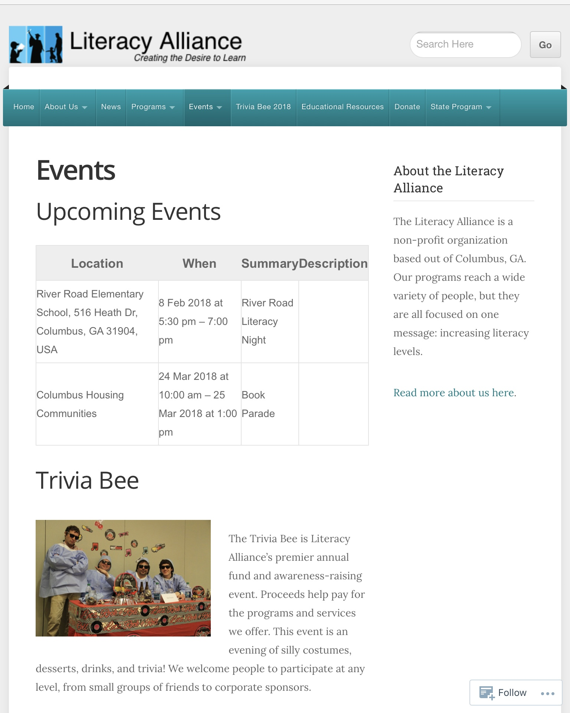

The Literacy Alliance is a nonprofit organization dedicated to literacy education in Columbus, Georgia. Beginning in 2017, I redesigned their website ([theliteracyalliance.org](https://theliteracyalliance.org/)) from the ground up with WordPress.

The new website highlights their current impact, their history, and streamlines the ability of users to volunteer, donate, or find educational resources. It's designed with modern web technologies, for users on desktop or mobile browsers.

<a class="wp-block-button__link" href="https://theliteracyalliance.org/">View the Literacy Alliance website here</a>

<ul class="wp-block-gallery alignfull columns-3 is-cropped">
    <li class="blocks-gallery-item">
        <figure>
            
        </figure>
    </li>
    <li class="blocks-gallery-item">
        <figure>
            
        </figure>
    </li>
    <li class="blocks-gallery-item">
        <figure>
            
        </figure>
    </li>
</ul>
<!-- /wp:gallery -->