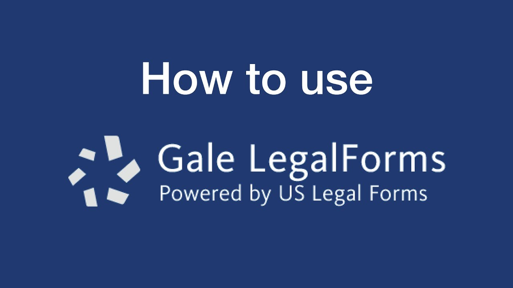
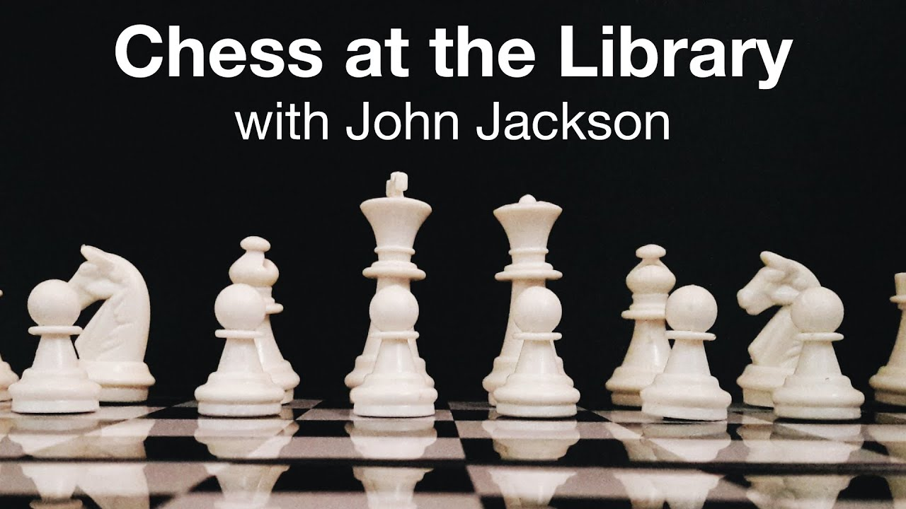

I produced instructional videos for Chattahoochee Valley Libraries as 
part of a response to the COVID-19 crisis. These videos were a way to extend
library services to patrons while our doors were closed to the public.

Video production involved iPhone and iPad cameras, iMovie software, and sundry
props available around the house.

## Library services

## Chess instruction

## Learn to code

